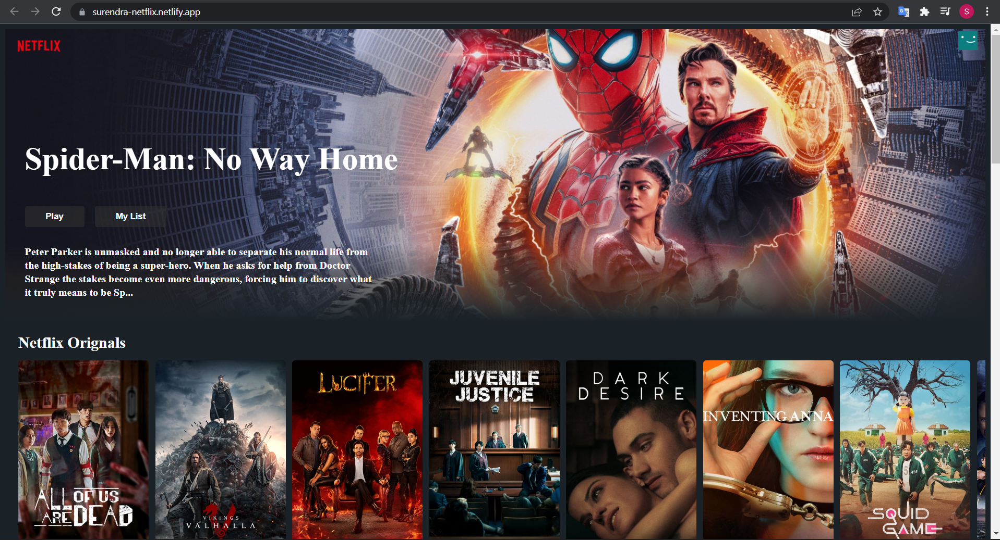
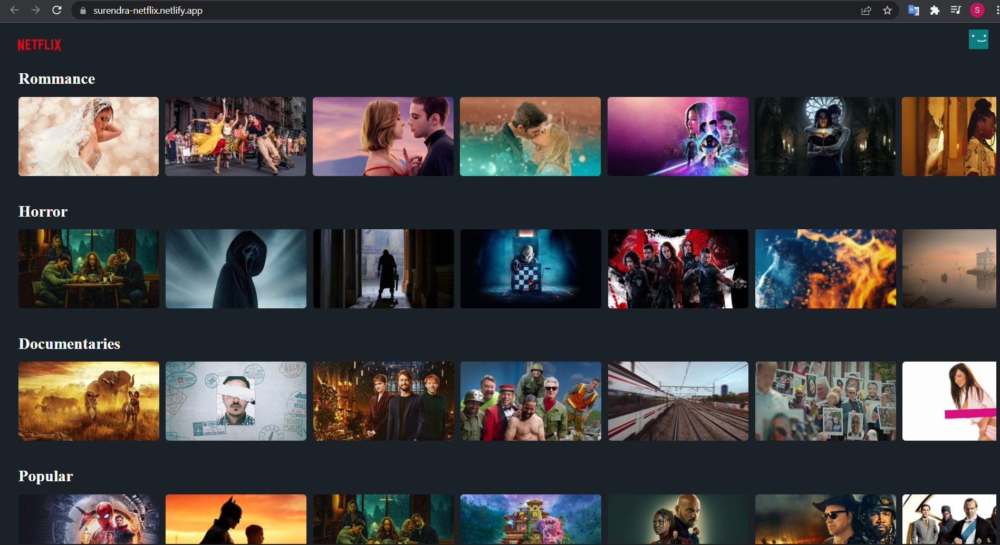
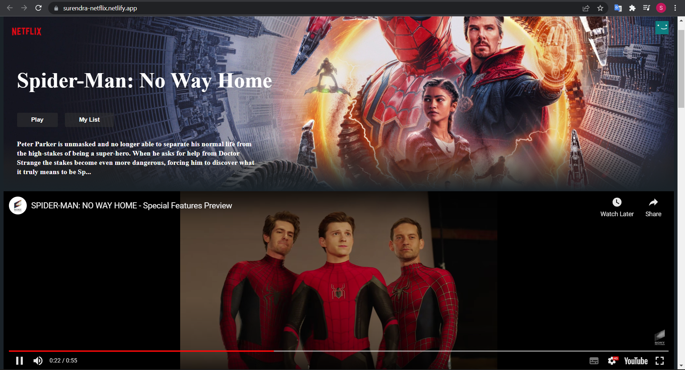

# NETFLIX CLONE  

This is a solo project, made for my practice and for better understandment of some react concepts.

**Project Link -** [NETFLIX CLONE](https://surendra-netflix.netlify.app/)

## About Me:

Hey,

  Surendra here, In 5th unit of Masai curriculum, I learnt about React, Context Api, Styled-Components and some other tools. In order to apply all these learnings to real world, I built this project. Here I clone the netflix home page and As there is no way to show the whole movie or netflix orignals, my end goal here is to play the trailer for the selected content.

## About Aha-Video: 

Netflix is an OTT platform where user can stream and watch various Tv shows(Netflix Orignals) and Movies from all over the world in different languages.

## Tech-Stacks & Tools:

* REACT
* CONTEXT API
* STYLED-COMPONENTS

## Glimpse of Project:

1. Home Page

2. Contents

3. Trailer Play

  
